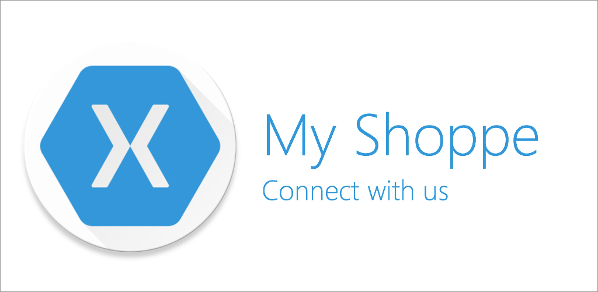
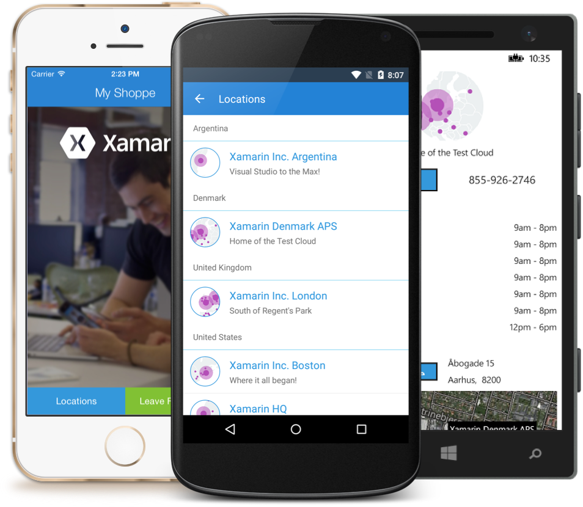
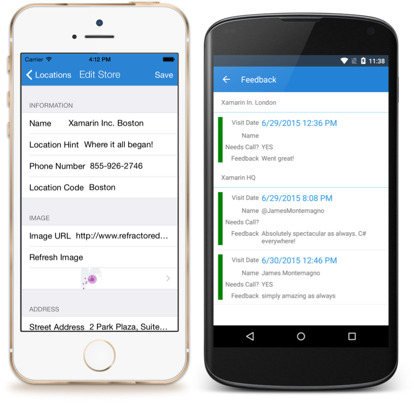
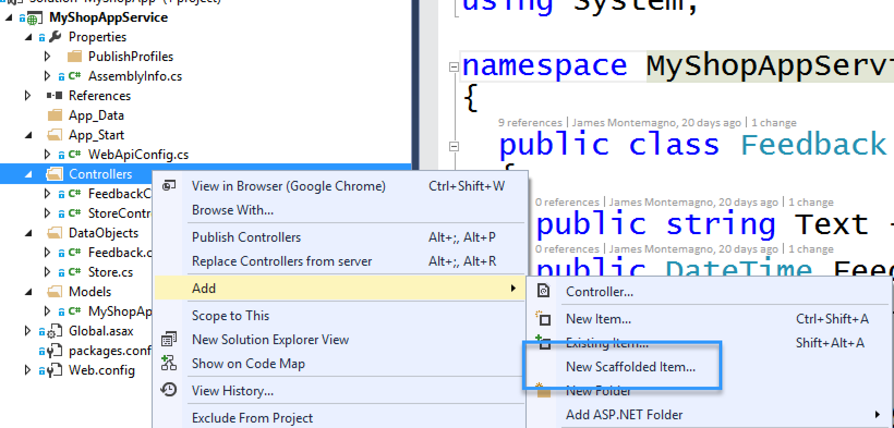
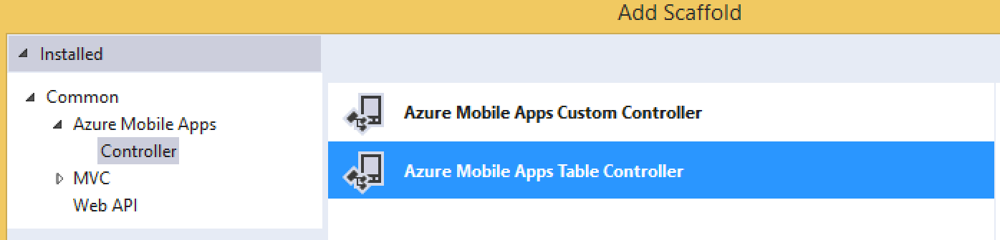
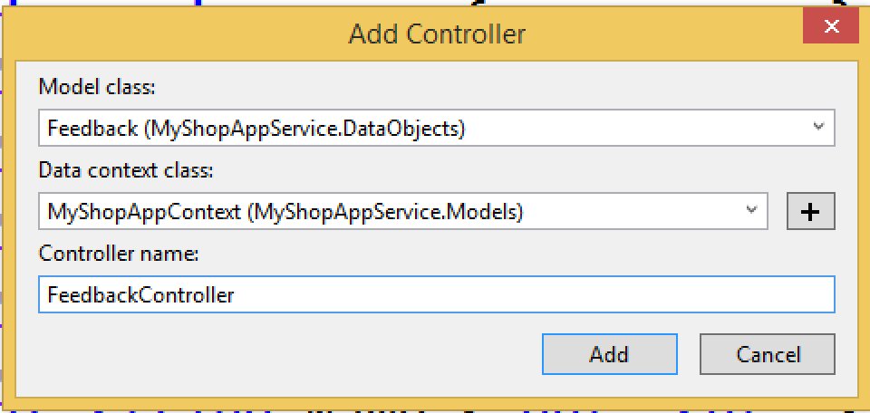

# My Shoppe - Connect with your consumers

My Shoppe is a cross-platform Xamarin.Forms pre-built application & template enabling you to easily connect with your customers and manage your shops. All powered by [Xamarin](http://www.xamarin.com), [Xamarin.Forms](http://www.xamarin.com/forms), and  a powerful Azure Mobile Apps backend with 100% shared C# code across iOS, Android, and Windows Phone.

This another Open Source Project by [@JamesMontemagno](http://www.twitter.com/jamesmontemagno)

Built with C# 6 features, you must be running VS 2015 or Xamarin Studio to compile. 



## Consumer Application
The My Shoppe consumer application enables you as a shop owner to easily connect with your consumer base. This application  enables you to create a browesable list of shop locations so your consumers can find the closest location to them, call the shop, see shop hours, and even navigate to the shop with a single click.

### Features
* Browse Stores / Locations (with online/offline sync)
* Location Information: address, phone, store hours, and more
* Navigate to Location
* Call Location with 1 click
* Leave feedback for visit



### Download Sample Application
You can download the sample My Shoppe application for the following platforms:

* **Android** available on [Google Play](https://play.google.com/store/apps/details?id=com.refractored.myshoppe)
* **iPhone & iPad** available on [App Store](https://itunes.apple.com/us/app/my-shoppe/id1014747999?ls=1&mt=8) 
* **Windows Phone** available on [Windows Store](https://www.windowsphone.com/en-us/store/app/my-shoppe/8641ed20-1bf6-412d-ae28-a5f785cc6546)

## Admin Application
In addition to the consumer application that you can release into the app stores, I created an Administration mobile application that allows you to manage all your shops and feedback from customers. It uses the same backend from the consumer application and even shares some of the same UI and code. 

### Features
* Create and Manage your Shops
* Browse & Manage Feedback from consumers
* Call back consumers with a single click



## My Shoppe Setup

### Azure Mobile Apps
My Shoppe leverages the brand new Azure App Service called [Azure Mobile Apps](http://azure.microsoft.com/en-us/services/app-service/mobile/) which is the next evolution of Azure Mobile Services. I have implemented the backend datastore with a simple interface, [IDataStore.cs](https://github.com/jamesmontemagno/MyShoppe/blob/master/MyShop/Interfaces/IDataStore.cs) that registers itself with the Xamarin.Forms Dependency Service. You could always create and implement your own XML or Json based service using this method.

**If you just want to try out My Shoppe there is a default sample Azure backend in place, however I have removed all ability to add/update/delete stores. You can however leave feedback and moderate it from the admin app for fun. If you want to setup your own Azure Mobile app, simply follow the steps below**

I have provided my existing .NET Backend for reference on how to create your controllers and data entities to publish to Azure. Read through the [Azure Mobile Apps tutorial](https://azure.microsoft.com/en-us/documentation/articles/app-service-mobile-xamarin-forms-get-started/) to learn how to create and setup your own Mobile Apps backend for My Shoppe. 

#### Creating Controllers
The Guide above walks you through settings up a default backend with a ToDo List, but we need to customize it a bit more. Ensure that you have the [Azure SDK for .NET installed](http://azure.microsoft.com/en-us/downloads/archive-net-downloads/) as you will need this for publishing and also to create the controllers. 

Open the server solution and under **DataObjects** add Feedback.cs and Store.cs from [MyShoppe/MyShopApp_Web/MyShopAppService/DataObjects](https://github.com/jamesmontemagno/MyShoppe/tree/master/MyShopApp_Web/MyShopAppService/DataObjects). Ensure you update your namespaces correctly.

Under Controllers simply right click and **Add -> New Item...** and if you have the Azure tools you will see **New Scaffold Item**. Select this option. 



Now Select **New Azure Mobile App Controller**



Select your DataObject, DataContext, and finalize the name (I use the default of StoreController and FeedbackController).



Do this for both Feedback and Store, and you are all set! You may want to remove all of the ToDo DataObjects and Controllers. 


#### Update Client
Once you have your backend setup you will want to enter your very own Azure Mobile Apps credentials in the [AzureDataStore.cs file on the following lines](https://github.com/jamesmontemagno/MyShoppe/blob/master/MyShop/Services/AzureDataStore.cs#L29-L32):

```
MobileService = new MobileServiceClient(
				"Mobile App URL",
				"Gateway URI",
				"Application Key");

```

### Add & Manage Stores
Once you have your Azure Mobile Apps backend setup you can easily add and manage stores with the My Shoppe Admin app for iOS or Android. If you do not add any stores, then no information will show up.

### [Xamarin Insights](http://www.xamarin.com/insights) Integration
Xamarin Insights provides a simple and effective way real time monitoring of your mobile apps for crashes and events. My Shoppe integrated Insights for both crash reporting and event tracking. Simply follow the [Xamarin Insights Documentation](https://insights.xamarin.com/docs) to create an API Key for your application. Once you have that simply replace all instances of the demo key: 
```
Insights.Initialize("c3d88c6f124fdabdf8880b65845094bb7bad90ac");
```
with
```
Insights.Initialize("Your Key");
```

These will be located in the MainActivity.cs, ApplicationDelegate.cs, and MainPage.xaml.cs.

### App Customization
Easily adjust the shop's name, sorting, and of course customize My Shoppe to Your Shoppe with your own branding and styles.

Simply replace the hero.png images with your companies logo or banner.

#### Brand Colors
Use your shop's brand colors and theming easily:

1. Modify [MyShoppe.Android/Resources/values/colors.xml](https://github.com/jamesmontemagno/MyShoppe/blob/master/MyShop.Android/Resources/values/colors.xml) with your Primary, Primary Dark, and Accent Color. I recommend using [materialpalette.com](http://www.materialpalette.com) for help.
2. String Replace 3498DB with your Primary color in all xaml pages


### Built with Xamarin & Amazing Plugins
Built in C# and powered by ([Xamarin](http://www.xamarin.com)) from inside of Visual Studio and Xamarin Studio. In addition there was a plethora of amazing NuGet packages and [Plugins for Xamarin](http://www.github.com/xamarin/plugins) that helped in the creation of this application. Please refer to to each NuGet packages license for the latest.


* [Azure Mobile Services SQLiteStore](https://www.nuget.org/packages/WindowsAzure.MobileServices.SQLiteStore/2.0.0-beta)
* [Connectivity Plugin for Xamarin & Windows](https://www.nuget.org/packages/Xam.Plugin.Connectivity/)
* [External Maps Plugin for Xamarin & Windows](https://www.nuget.org/packages/Xam.Plugin.ExternalMaps/)
* [Image Circle Control Plugin for Xamarin.Forms](https://www.nuget.org/packages/Xam.Plugins.Forms.ImageCircle/)
* [Json.NET](https://www.nuget.org/packages/Newtonsoft.Json/)
* [Messaging Plugin for Xamarin and Windows](https://www.nuget.org/packages/Xam.Plugins.Messaging/)
* [Microosft HTTP Client Libraries](https://www.nuget.org/packages/Microsoft.Net.Http/)
* [Portable Class Library for SQLite](https://www.nuget.org/packages/SQLitePCL/)
* [Settings Plugin for Xamarin and Windows](https://www.nuget.org/packages/Xam.Plugins.Settings/)
* [Windows Azure Mobile Services](https://www.nuget.org/packages/WindowsAzure.MobileServices/2.0.0-beta)
* [Windows Phone Theme Manager](https://www.nuget.org/packages/PhoneThemeManager/)
* [Windows Phone Toolkit](https://www.nuget.org/packages/WPtoolkit/)
* [Xamarin Google Play Services](https://www.nuget.org/packages/Xamarin.GooglePlayServices/)
* [Xamarin Support Library v4](https://www.nuget.org/packages/Xamarin.Android.Support.v4/)
* [Xamarin Support Library v7 AppCompat](https://www.nuget.org/packages/Xamarin.Android.Support.v7.AppCompat/)
* [Xamarin Support Libarry v7 MediaRouter](https://www.nuget.org/packages/Xamarin.Android.Support.v7.MediaRouter/)
* [Xamarin.Forms](https://www.nuget.org/packages/Xamarin.Forms/)
* [Xamarin.Forms.Maps](https://www.nuget.org/packages/Xamarin.Forms.Maps)
* [Xamarin Insights](https://www.nuget.org/packages/Xamarin.Insights/)


## License
The MIT License (MIT)
Copyright (c) 2015 Refractored LLC / James Montemagno

See latest License file [here](https://github.com/jamesmontemagno/MyShoppe/blob/master/LICENSE).

## Privacy Policy
Please see the latest at: http://refractored.ghost.io/about/
